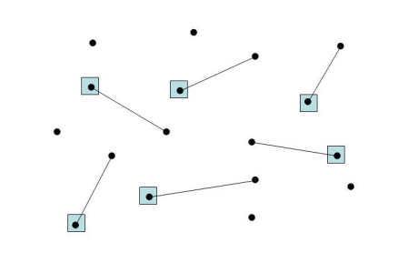

#### Exercise 5

```textile
Suppose now that the BaceFook network can be any graph. Design and implement a Greedy algorithm for the problem.
Moreover, generate 100 different graphs of 100 nodes. To do this, you may use the random Python library: in particular, the function bool(random.getrandbits(1)) can be used to return a random Boolean, that in turn can be used to decide whether to add or not a given edge.
Finally, evaluate how the greedy algorithm performs on these graphs. Does the algorithm return an optimal solution? If not, can you bound the approximation ratio of the algorithm?
```

The underlying problem is called Vertex Cover, in particular minimum vertex cover.

A vertex cover is a set of vertices such that each edge of a graph is incident to at least one vertex of the set.

We designed and implemented a greedy algorithm for the exercise 5 that is linear in m -> **O(m)**, where m is the total number of edges.

```textile
Let C be a collection of vertices
Let E contain all the edges of the graph

C <- empty

While E is not empty:
    select an edge {(u,v)}
    C <- C U {(u,v)}
    delete all incident edges of u and v
Return C
```

The approximation ratio is bounded. Specifically this is a 2-approximation algorithm.

###### The algorithm returned a vertex cover.

All edges in E \ C are such that at least one of their end-points is incident to some e in C (otherwise, that edge should be added to C). Moreover every edge in E has at least one end-point in C. 

###### The approximation ratio is 2

<div>


Assume this is the result of the execution of the algorithm.
The pairs of vertices are in C and the edges shown are the ones
whose endpoints are added into C.

</img>
</div>

To see that the ratio is 2, consider the edges whose endpoints are in C. (u,v) To cover these edges we need a vertex for each edge, since there aren't 2 edges that share a vertex with each other. This implies that the optimal vertex cover has size at least that number of vertices, let's say X. 

$$
OPT(V) \geqslant X
$$

The cover returned contains 2X vertices. So for each v we have:

$$
2*OPT(V) \geqslant 2*X \Leftrightarrow 2*OPT(V) \geqslant |C| 
$$

Before this algorithm we explored another path.

```textile
Let C be a collection of vertices
Let E contain all the edges of the graph
C <- empty

While E is not empty:
    Pick a vertex v ∈ V of
    maximum degree in the current graph
    C ← C ∪ {v}
    E ← E \ {e ∈ E : v ∈ e} //delete all incident edges
return C
```

The reasoning behind this algorithm is: we choose the highest degree vertex, because it covers the highest number of friends in the BaceFook network graph, so we minimize the number of software installations.

However this algorithm does not have a bounded ratio. By choosing vertices 1 by 1, we cannot be sure that those who are chosen are in the optimal vertex cover. If we add couples of vertices we are sure that at least one of them is in the minimum vertex cover.

##### Usage

```bash
python3.6 main.py
```

Executing the main script will create the required 100 graphs with 100 vertices and the random number of nodes. The graph will be modified after the execution of the function. If you want to avoid that, pass a deepcopy instead.

```bash
pip3 install copy
import copy
deep_g = copy.deepcopy(g)
```
